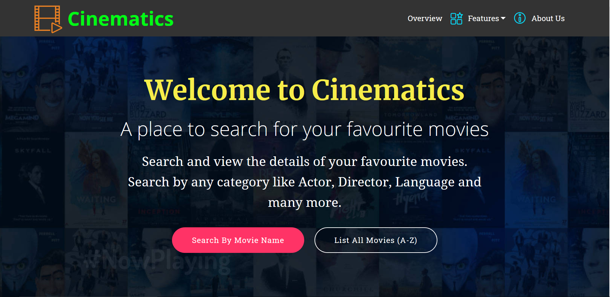
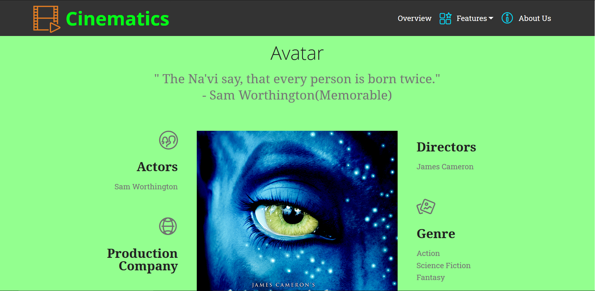

<p align="center">
  <a href="" rel="noopener">
 </a>
</p>

<h1 align="center">Cinematics</h1>

<div align="center">

[]()
[](https://github.com/vijethph/cinematics/issues)
[](https://github.com/vijethph/cinematics/graphs/contributors)
[](https://github.com/vijethph/cinematics/network)
[](https://github.com/vijethph/cinematics/stargazers)
[](https://github.com/vijethph/cinematics/pulls)
[](https://github.com/vijethph/cinematics/blob/master/LICENSE)
[](https://forthebadge.com)
[](https://forthebadge.com)
[](https://heroku.com/deploy)


</div>

---

<h4 align="center"> A Spring Boot Application which gives information about movies, and has a database of released movies.
    <br> Made with Spring Boot, Thymeleaf and PostgreSQL
</h4>

## :scroll: Table of Contents

- [Screenshots](#screenshots)
- [About](#about)
- [Getting Started](#getting_started)
- [Deployment](#deployment)
- [Usage](#usage)
- [Built Using](#built_using)
- [Authors](#authors)
- [Acknowledgments](#acknowledgement)

## :framed_picture: Screenshots <a name="screenshots"></a>




## :information_source: About <a name = "about"></a>

This is a Spring Boot application which stores a database of released movies. It uses Spring Boot Framework for overall handling, Thymeleaf template engine for displaying and retrieving variables, and PostgreSQL to store the collection of movies.

Users can search for their favourite movies, actors and directors based on name and can view more details about them.

## 🏁 Getting Started <a name = "getting_started"></a>

Follow these instructions in order to get a copy of the project up and running on your local machine for development and testing purposes. See [deployment](#deployment) for notes on how to deploy the project on as a live server.

### Prerequisites

Java runtime version 8 (JAVA SE 8), Apache Maven>=3.6 and PostgreSQL>=9.0 are required.

After installing, check their versions using these commands

```
java -version
mvn -v
```

### 🧱 Installing <a name="installing"></a>

Clone this project and open this project in terminal.

```
cd cinematics
```

And run the project using following command and check the output at https://localhost:8080 in your browser.

```
mvn spring-boot:run
```

If it shows any errors then run the following command before executing the above command:

```
maven package
```
or
```
mvn clean install
```

<!--## 🔧 Running the tests <a name = "tests"></a>
Explain how to run the automated tests for this system.

### Break down into end to end tests
Explain what these tests test and why

```
Give an example
```

### And coding style tests
Explain what these tests test and why

```
Give an example
```
-->

## 🎈 Usage <a name="usage"></a>

This application can be used by everyone if it is deployed using the steps in [deployment](#deployment). For usage by a single user, the following steps should be followed:

- After starting the server, and opening https://localhost:8080 your browser, the homepage of application website will be displayed. From there you can navigate to any sections as per your choice.
- Try using any of the search options provided and feel free to browse through the details given. For some of the search options, the results will be displayed at the bottom of the page.

## 🚀 Deployment <a name = "deployment"></a>

The application can be deployed to Heroku so that everyone can access it through the internet. To do this you must have a Heroku account and a suitable plan. Simply click this badge to deploy the application to Heroku.

Now the project is deployed. It will show an output giving a website address like this:

```
deployed at
```

Ask your friends to open up the specified url and use the application.

## ⛏️ Built Using <a name = "built_using"></a>

- [Spring Boot](https://spring.io/projects/spring-boot/) - Server Framework
- [Thymeleaf](https://www.thymeleaf.org/) - HTML Template Engine
- [PostgreSQL](https://www.postgresql.org) - Relational DBMS

## ✍️ Authors <a name = "authors"></a>

- [@vijethph](https://github.com/vijethph) - Idea & Full Development

See also the list of [contributors](https://github.com/vijethph/) who participated in this project.

## 🎉 Acknowledgements <a name = "acknowledgement"></a>

- Thanks to project sessions conducted by my college.
- Inspiration: Project Ideas for Spring Boot
- References: Spring Boot and Thymeleaf Documentations.

### Made with ❤ in India
